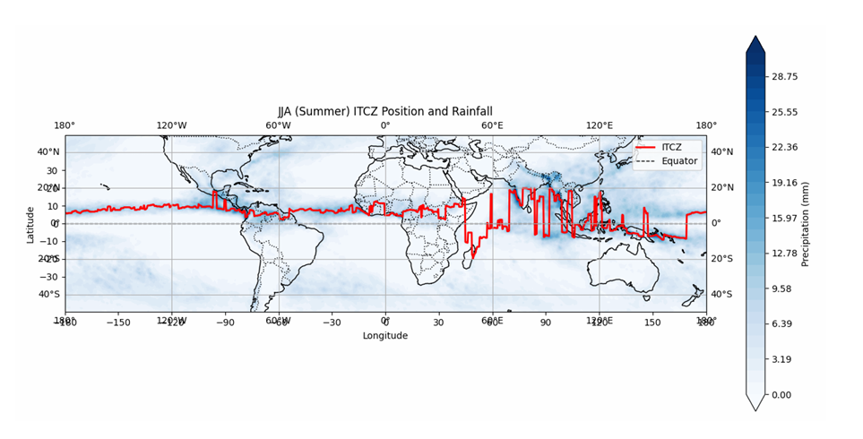
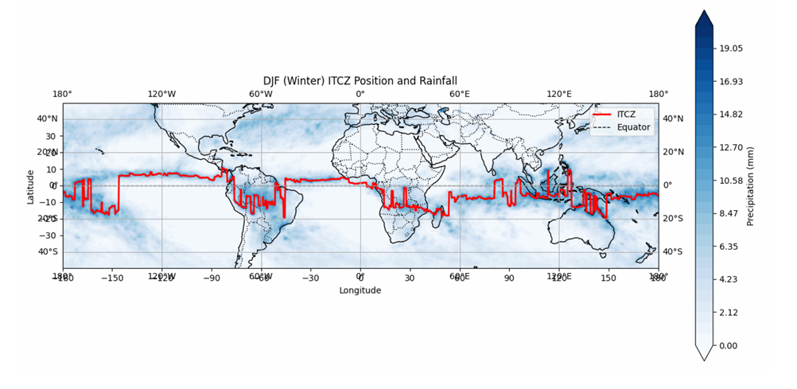
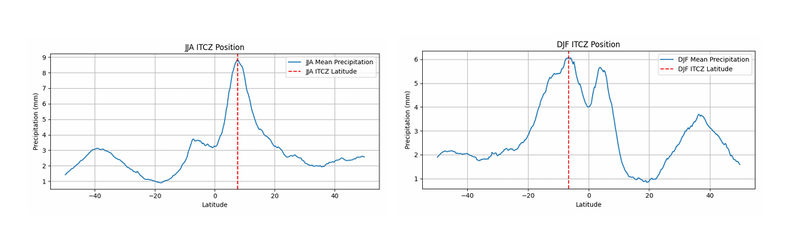

# ASL 757 - ITCZ Seasonal Position Analysis

Finds the latitude of the ITCZ for DJF (winter) and JJA (summer) from gridded precipitation data and plots it on a global map.

---

## Results

| Season | ITCZ Latitude |
|--------|--------------|
| DJF (Winter) | −6.625° |
| JJA (Summer) | +7.625° |

### JJA ITCZ Position


### DJF ITCZ Position


### Mean


---

## Dataset

- Monthly Precipitation, 2010
- Spatial Resolution: 0.25° × 0.25°
- Variable: `pr`

---

## Files

| File | Description |
|------|-------------|
| `itcz_analysis.py` | Calculates ITCZ latitude for DJF and JJA |
| `itcz_map.py` | Plots ITCZ path over global rainfall maps |

---

## Methodology

- Extract seasonal subsets (DJF, JJA) using xarray
- Average rainfall over time and longitude → zonal mean per latitude
- ITCZ latitude = latitude of peak zonal rainfall
- For maps: find max-rainfall latitude per longitude, apply Gaussian smoothing, restrict to ±20° band

**Map legend:** red line = ITCZ, blue shading = rainfall (mm), dashed line = equator

---

## Usage

```bash
pip install xarray numpy scipy matplotlib cartopy
python itcz_analysis.py
python itcz_map.py
```
